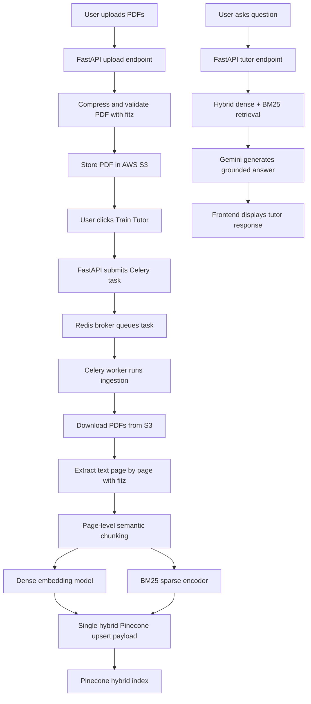
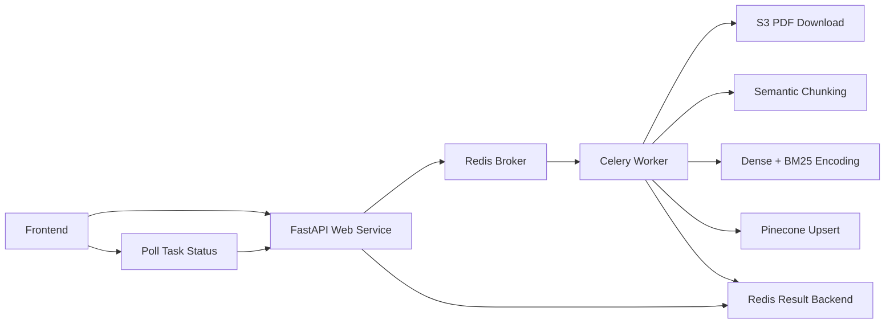

# Personalized RAG Tutor AI

Personalized RAG Tutor AI is a full-stack tutoring application that lets users upload PDF learning material, build a retrieval index from that material, and chat with an AI tutor that answers using the uploaded content as grounding context.

The project is designed around a production-style Retrieval-Augmented Generation pipeline:

- PDFs are uploaded through the frontend and stored in AWS S3.
- The backend ingests PDFs from S3 using PyMuPDF.
- Text is extracted page by page, cleaned, semantically chunked, and stored in Pinecone.
- Each chunk is indexed with both dense embeddings and BM25 sparse token weights.
- Chat requests use hybrid retrieval to fetch relevant source chunks before generating tutor responses.
- Long-running ingestion runs in a Celery worker through Redis so the API does not timeout.

## Tech Stack

### Frontend

- Next.js 14
- React 18
- TypeScript
- Tailwind CSS
- GSAP animations
- Vercel deployment

### Backend

- FastAPI
- Python 3.10
- Gunicorn + Uvicorn worker
- LangChain
- LangChain Experimental `SemanticChunker`
- PyMuPDF / `fitz` for PDF loading and text extraction
- Celery for background ingestion jobs
- Redis / Render Key Value as Celery broker and result backend

### Retrieval and Storage

- AWS S3 for uploaded PDF storage
- Hugging Face Inference Providers for dense embeddings
- `ibm-granite/granite-embedding-97m-multilingual-r2`
- Pinecone for dense + sparse hybrid search
- `bm25s` for lightweight BM25 sparse encoding
- Google Gemini for tutor generation

## Project Flow



## Ingestion Flow

The ingestion service lives in:

```text
rag-tutor-ai-backend/app/services/ingest.py
```

The high-level ingestion process is:

1. List available PDFs from S3.
2. Check Pinecone metadata to avoid reprocessing already indexed files.
3. Download new PDFs from S3.
4. Open each PDF using `fitz.open(stream=pdf_bytes, filetype="pdf")`.
5. Extract text one page at a time.
6. Clean text by normalizing whitespace and removing simple page labels.
7. Create one LangChain `Document` per PDF page with metadata:

```python
{
    "source_file": "...",
    "source_name": "...",
    "page": 0
}
```

8. Run page-level semantic chunking.
9. Print the top 10 generated chunks for debugging.
10. Upload chunks to Pinecone in batches of 100.

PDF parsing is run concurrently with a `ThreadPoolExecutor`, while the expensive chunking and embedding work happens inside the Celery worker in production.

## Page-Level Semantic Chunking

The project uses page-level semantic chunking instead of splitting the full book as one giant text blob.

That means each PDF page becomes its own starting document before semantic splitting. This keeps chunks tied to the correct page and makes citations/debugging much easier.

Current chunking strategy:

- Process pages in batches of 10.
- Skip semantic chunking for short pages under 600 characters.
- Store short pages as a single chunk with `chunking_strategy = "short_page_skip"`.
- For longer pages, use LangChain `SemanticChunker`.
- Use the vector embedding model to detect semantic breakpoints.
- Use percentile breakpoint thresholding with threshold amount `70`.
- Use `min_chunk_size = 450`.

Each generated chunk keeps page-aware metadata:

```python
{
    "source_file": "...",
    "source_name": "...",
    "page": 12,
    "chunking_strategy": "langchain_page_semantic",
    "page_chunk_index": 0,
    "page_chunk_count": 3
}
```

Why this matters:

- Chunks stay grounded to the original PDF page.
- Retrieval results can show page-level references.
- Short front-matter pages avoid unnecessary embedding calls.
- Long pages are split by meaning, not only by character count.
- Large PDFs avoid request timeout because chunking runs in Celery.

## Hybrid Retrieval

The project uses a single Pinecone index for hybrid retrieval.

Each stored chunk contains:

- Dense embedding vector from Hugging Face.
- Sparse BM25 vector from `bm25s`.
- Metadata, including source file, page, chunk indexes, and original text.

The BM25 implementation is in:

```text
rag-tutor-ai-backend/app/db/bm25.py
```

The sparse encoder:

1. Tokenizes chunk text with `bm25s`.
2. Builds BM25 token weights.
3. Hashes each token into a stable Pinecone sparse index.
4. Maps the result into Pinecone's required sparse payload:

```python
{
    "indices": [123, 456],
    "values": [0.82, 0.41]
}
```

During upsert, each chunk becomes one hybrid Pinecone vector:

```python
{
    "id": "...",
    "values": dense_vector,
    "sparse_values": {
        "indices": [...],
        "values": [...]
    },
    "metadata": {
        "text": "...",
        "retrieval_strategy": "hybrid_dense_bm25",
        "source_file": "...",
        "page": 0
    }
}
```

At query time:

- The question is embedded into a dense vector.
- The question is encoded into a BM25 sparse vector.
- `HYBRID_ALPHA` controls the weighting.

```text
HYBRID_ALPHA=0.5
```

Higher values favor dense semantic similarity. Lower values favor BM25 keyword matching.

## Production System Design With Redis and Celery

PDF ingestion can take too long for a normal web request, especially for large books with hundreds of pages. To avoid Render request timeouts, ingestion is moved out of the FastAPI request process and into a Celery worker.

Production architecture:



The request flow is:

1. Frontend calls:

```text
POST /api/v1/ingest/run-ingestion?reset_db=false
```

2. FastAPI submits a Celery task and immediately returns:

```json
{
  "status": "queued",
  "task_id": "...",
  "message": "Ingestion task queued."
}
```

3. Celery worker receives the task from Redis.
4. Worker performs PDF ingestion, semantic chunking, embeddings, BM25 encoding, and Pinecone upsert.
5. Frontend polls:

```text
GET /api/v1/ingest/ingestion-tasks/{task_id}
```

6. The UI shows task states:

```text
PENDING -> STARTED -> SUCCESS
PENDING -> STARTED -> FAILURE
```

This keeps the web API responsive while ingestion runs in the background.

